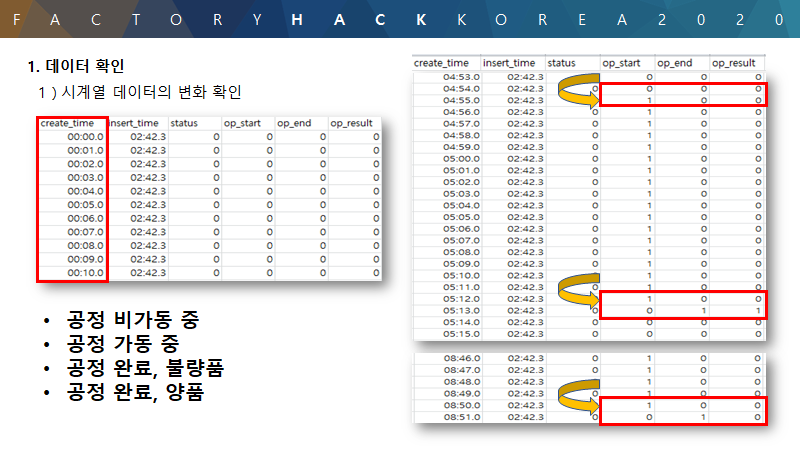
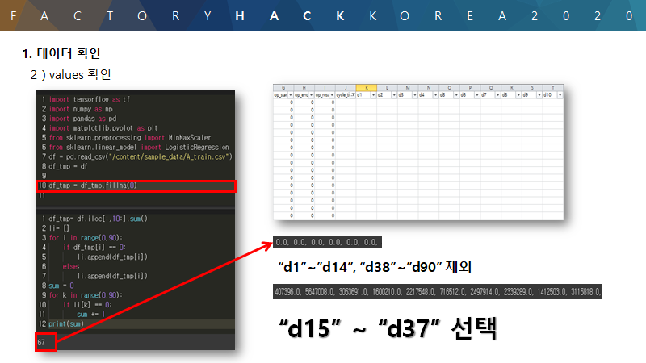
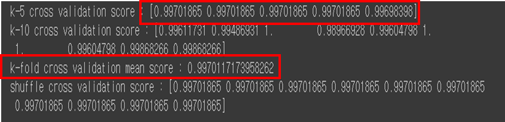

# 2020 FACTORYHACK_KOREA 

> 본 프로젝트는 2020.01 열린 실제 제조데이터를 활용한 무박2일 데이터 분석 경진대회입니다.

## 1. 대회 주제

전자부품연구원의 데모공장과 스마트제조연구센터의 교육장의 제조데이터센터 내 제조데이터 환경에서 AI활용을 통해 문제해결을 위한 제품 / 서비스 / 알고리즘 등을 개발

## 2. 문제 

#### 1.문제: A-1. 양/불량 예측 모델 개발 

트레이닝 데이터셋으로 예측 모델을 training하여, 모델을 평가하기 위해 적합한 metric을 선정하고, 테스트 데이터셋에 해당 metric 기반의 예측 모델을 적용하여 모델의 성능을 평가하라

#### 2. 문제: A-2. 양/불량 예측 모델 정확도 모니터링 방안
일반적으로 한번 트레이닝 된 모델은 시간, 환경 변화하고 새로운 데이터가 들어오며 그 성능이 감소한다. 이를 모니터링하기 위한 metric과 방안, 정확도를 계산할 시간단위를 제시하고, 이를 구현하라.

#### 3. 문제: A-3. 양/불량 예측 모델 업데이트 방안
A-2 문제에서 제시한 방법에 따른 모델 성능 감소를 해소할 수 있는 지속적인 예측 모델 업데이트 방안을 고안하여 발표하라.

## 3. 해결방안

#### 1. Data preprocessing

​																						↓

#### 2. Model develop

공정 가동상태에 따른 Multinomial Classification과 양/불량에 따른 Logistic Classification을 활용하여 각 모델에 따른 K-fold Cross validation을 진행 

> 자세한 내용은 소스코드 참조

#### 3. Update 방안

##### 제안 

1. 해당 문제는 불량품 발생 시  cycle_time value가 0에서 1로 바뀌는 event가 발생
   * 이를 활용하여 해당 test set 정답맞추기는 가능하나 실제제조환경에서 적용 불가능

2. 도메인 지식 활용이 불가능하기 때문에 (해당 문제는 데이터 익명화처리 되어 있음) 불량에서 발생하는 센서데이터를 민감도 분석하여 데이터의 증분 처리를 진행해야함.
3. 3시그마 수준 이상의 품질관리가 이루어지는 제조환경에서 머신러닝을 활용한 관리한계를 끌어올리기 위해서는 설비 단계를 더욱 세분화하여 미세한 단위에서 학습기초 마련이 필요

## 4. 한계점

#### 1. 어떤 공정을 기반으로 한 데이터인지에 대해 알 수 없어서 결측치, 이상치에 대한 기준을 정하기 어려웠습니다.

#### 2. 공정 비가동 데이터를 제외한 채 모델을 학습하였기 때문에, 유휴시간에 따른 영향을 고려하지 못하였습니다.

#### 3.각 cycle의 추이를 수치화하지 못하여, 향후 공정의 양품/불량품률 예측을 하지 못한 점이 아쉬웠습니다.

